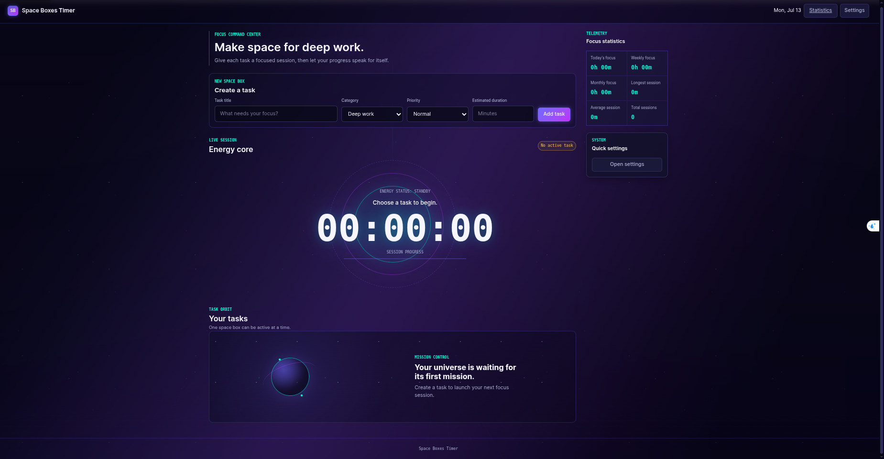
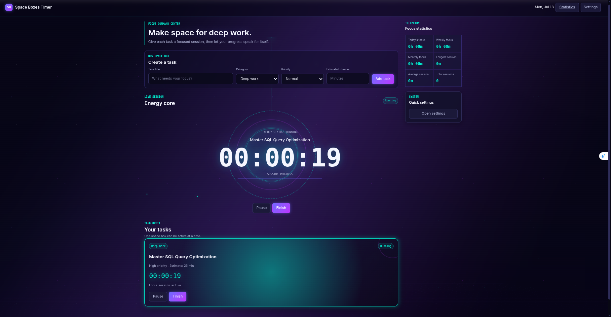
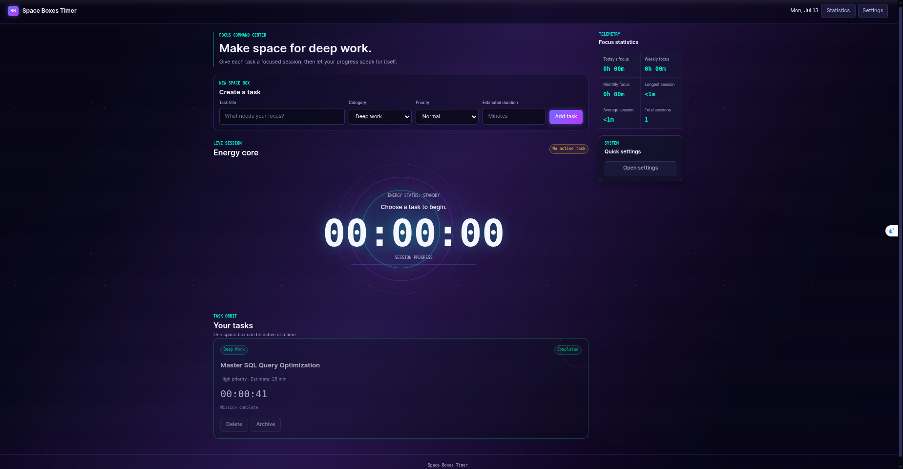
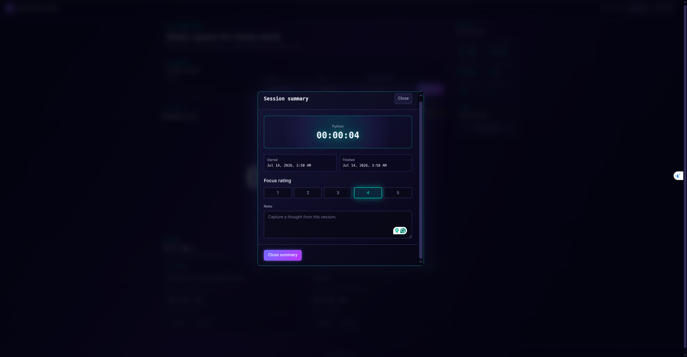

<div align="center">

# Space Boxes Timer

<p><strong>Deep work, made visible.</strong></p>

A local-first focus timer for doing one demanding task at a time.

[](LICENSE)
[](CHANGELOG.md#v100)
[](https://m950m.github.io/space-boxes-timer/)
[](index.html)
[](css/)
[](js/)
[](#ai-assisted-engineering)

[Live Demo](https://m950m.github.io/space-boxes-timer/) · [Report an Issue](https://github.com/m950m/space-boxes-timer/issues) · [Contributing](CONTRIBUTING.md)

</div>

## Project overview

Space Boxes Timer is a stable, browser-based productivity application that turns tasks into focused, visually responsive work sessions. It combines task lifecycle management, an elapsed-time engine, session summaries, and local statistics in a dark-space interface designed to make sustained concentration feel tangible.

## Why this project exists

Most productivity tools optimize the management of task lists. Space Boxes Timer focuses instead on the experience of doing one task deeply.

The long-term vision is not another general-purpose task manager. It is a personal deep-work and research companion for demanding technical learning, graduate-level study, and sustained independent inquiry. The current release establishes a deliberately narrow foundation: reliable local sessions, honest statistics, and a calm interface that supports concentration.

## Design philosophy

- **One active mission.** Attention stays attached to one running task.
- **Minimal distraction.** The timer and current session remain visually dominant.
- **Feedback over gamification.** State, progress, and reflection replace points or rewards.
- **Local-first ownership.** Personal work history remains under the user's control.
- **Calm visual hierarchy.** Motion communicates activity without competing for attention.

## Live demo

The current browser release is available on GitHub Pages:

**[Open Space Boxes Timer](https://m950m.github.io/space-boxes-timer/)**

## Screenshots

### Dashboard

The complete workspace, including task creation, the Energy Core, focus statistics, and the empty task state.



### Running Session

An active focus mission with the elapsed timer, session controls, and synchronized task state.



### Completed Session

A completed mission with its recorded duration and updated focus statistics.



### Session Summary

The post-session review for duration, focus rating, and optional notes.



## Features

### Focus sessions

- Create tasks with a title, category, priority, and optional time estimate.
- Start, pause, resume, and finish elapsed-time focus sessions.
- Enforce one running task across the application.
- Track distinct intervals across pause and resume transitions.
- Display estimate-based progress without forcing an automatic stop.
- Complete sessions with a focus rating and notes.

### Task lifecycle and persistence

- Delete, archive, and restore tasks.
- Preserve elapsed time and running or paused state across page reloads.
- Persist tasks, settings, and derived statistics in browser storage.
- Recover safely from unavailable or structurally invalid persisted data.
- Reset all application-owned local data.

### Statistics

- Calculate today's, weekly, and monthly focus time.
- Report longest session, average session, and total session count.

## Engineering principles

- **Modular architecture.** Each module owns one clear part of the application lifecycle.
- **Separation of concerns.** Domain logic, persistence, statistics, timing, and DOM rendering remain independent.
- **Local-first operation.** The browser is both the runtime and the data boundary.
- **Dependency-free delivery.** The project ships as static HTML, CSS, and JavaScript.
- **Predictable state transitions.** Task and timer operations validate their allowed states.
- **Accessibility by design.** Semantic HTML, keyboard behavior, focus management, and motion preferences are part of the implementation.
- **Browser-native foundations.** Native forms, templates, storage, timing, and formatting APIs keep the system understandable and portable.

## Architecture

```text
User interaction
      │
      ▼
    ui.js ─────────────── DOM rendering and accessible interaction
      │
      ▼
    app.js ────────────── Application lifecycle and coordination
      │
      ├── tasks.js ────── Task state and focus-session intervals
      ├── timer.js ────── Live elapsed-time engine
      ├── storage.js ──── Versioned browser persistence
      ├── statistics.js ─ Pure session aggregation
      ├── modal.js ────── Summary and confirmation data
      └── utils.js ────── Shared validation and formatting
```

| Module | Responsibility |
| --- | --- |
| `js/app.js` | Restores state, initializes services, coordinates actions, persists changes, and controls the timer update interval. |
| `js/ui.js` | Owns DOM queries, rendering, event binding, task-card generation, modal focus behavior, and user-facing updates. |
| `js/tasks.js` | Defines task state transitions, validates persisted records, records focus intervals, and enforces one running task. |
| `js/timer.js` | Tracks elapsed time with a monotonic clock independently of the interface. |
| `js/storage.js` | Reads, writes, and clears versioned records through a localStorage-compatible backend. |
| `js/statistics.js` | Calculates time-period totals and session aggregates from task history. |
| `js/modal.js` | Prepares serializable session-summary and confirmation data without manipulating HTML. |
| `js/utils.js` | Provides identifiers, cloning, validation, date and duration formatting, debounce, and throttle helpers. |

Business logic does not manipulate the DOM.

## Technology stack

| Layer | Technology |
| --- | --- |
| Document | Semantic HTML5, templates, forms, progress elements, and ARIA |
| Presentation | CSS custom properties, Grid, Flexbox, responsive media queries, and CSS-only animation |
| Application | Vanilla JavaScript with ES modules and private class fields |
| Persistence | Browser `localStorage` with a versioned schema |
| Time and formatting | `performance.now()`, `Date`, and `Intl.DateTimeFormat` |
| Delivery | Static files hosted through GitHub Pages |

## Project structure

```text
space-boxes-timer/
├── index.html
├── assets/
│   └── screenshots/
│       ├── hero-dashboard.png
│       ├── active-session.png
│       ├── completed-session.png
│       └── session-summary.png
├── css/
│   ├── style.css
│   ├── layout.css
│   ├── animations.css
│   └── modal.css
├── js/
│   ├── app.js
│   ├── ui.js
│   ├── tasks.js
│   ├── timer.js
│   ├── storage.js
│   ├── statistics.js
│   ├── modal.js
│   └── utils.js
├── PROJECT_SPEC.md
├── AGENT_RULES.md
├── TASKS.md
├── DEVLOG.md
├── CHANGELOG.md
├── CONTRIBUTING.md
├── LICENSE
└── README.md
```

## Data ownership and storage

**Users fully own their Space Boxes Timer data.**

- All task, session, settings, and statistics data remains inside the user's browser.
- Nothing leaves the browser through application code.
- No backend or remote database exists.
- No accounts or authentication exist.
- No tracking, telemetry, or analytics code is included.

The application owns three versioned `localStorage` entries:

| Key | Stored data |
| --- | --- |
| `space-boxes-timer:tasks` | Task fields, lifecycle state, timestamps, elapsed time, focus intervals, notes, focus score, and archive state. |
| `space-boxes-timer:settings` | Theme identifier and the stored sound-effect and notification preferences. The current release does not produce sounds or browser notifications. |
| `space-boxes-timer:statistics` | Derived focus-time and session aggregates. These values are recalculated from task history when the application starts. |

Each entry uses an envelope containing a schema `version` and its corresponding `data` value. Resetting the application removes only these application-owned keys.

To inspect the records in a Chromium-based browser:

1. Open the application.
2. Open DevTools.
3. Select **Application**.
4. Expand **Local Storage**.
5. Select the application's origin.

In Firefox, open DevTools and use the **Storage** panel.

Export and import are intentionally not implemented in this release. They may be added in a future version.

The planned design preserves the same local-first boundary: export will create a user-controlled, versioned JSON file, while import will validate a selected file locally before updating application-owned records. Neither operation requires a remote service.

## Installation

No dependency installation or build command is required.

```bash
git clone https://github.com/m950m/space-boxes-timer.git
cd space-boxes-timer
python3 -m http.server 8765
```

Then open [http://localhost:8765](http://localhost:8765).

The application uses native ES modules, so it should be served over HTTP rather than opened directly through a `file://` URL.

## Usage

1. Enter a task title and optionally choose its category, priority, and estimated duration.
2. Select **Launch Mission** to create the task.
3. Select **Start** on a task to begin its focus session.
4. Use **Pause** and **Resume** without losing accumulated time.
5. Select **Finish** when the work is complete.
6. Review the session summary, optionally choose a focus rating, and add notes.
7. Use the statistics panel to review accumulated focus time and session history.
8. Archive tasks that should remain in local history, restore archived tasks when needed, or delete them permanently.

## Accessibility

The interface includes:

- Semantic regions, headings, forms, labels, buttons, and time elements.
- ARIA labels and live task-list updates.
- Keyboard-operable controls and focus-visible styling.
- Modal focus trapping, Escape-key closure, and focus restoration.
- Arrow-key navigation for the focus-rating radio group.
- An inert application background while a modal is open.
- Responsive text and control layouts.
- `prefers-reduced-motion` handling that disables continuous decorative animation.

These measures are part of the implementation; the project does not claim a formal accessibility certification.

## Performance

Space Boxes Timer remains lightweight because it ships as static HTML, CSS, and JavaScript with:

- No framework or third-party runtime.
- No package dependency graph.
- No build output or client-side router.
- No external images, fonts, or icon libraries.
- Event delegation for task actions.
- A single guarded timer interval with targeted one-second display updates.
- CSS-only decorative visuals and reduced-motion fallbacks.

## Roadmap

The roadmap describes candidate release scope, not commitments.

### v1.1.0

- Export and import of local data.
- Application-level keyboard shortcuts.

### v1.2.0

- Enhanced statistics and historical views.
- Additional visual themes.

### Future exploration

- Advanced focus analytics for longer-term study patterns.

## AI-assisted engineering

Space Boxes Timer was developed through an AI-assisted engineering workflow. AI tools were used as engineering productivity aids during implementation, analysis, testing, and review. Architecture decisions, engineering constraints, requirements, testing direction, review criteria, and final acceptance were directed by the project owner.

## Contributing

Contributions should preserve the project's module boundaries and focused scope. Before making a change, read [PROJECT_SPEC.md](PROJECT_SPEC.md), [TASKS.md](TASKS.md), [AGENT_RULES.md](AGENT_RULES.md), and [CONTRIBUTING.md](CONTRIBUTING.md).

1. Fork the repository and create a focused branch.
2. Keep changes limited to one clearly defined task.
3. Preserve the separation between domain logic and DOM rendering.
4. Validate the affected workflow in a local browser.
5. Explain the change and its verification when opening a pull request.

## License

Space Boxes Timer is available under the [MIT License](LICENSE).

## Author

**Mohammed Nabil**

- [GitHub](https://github.com/m950m)
- [LinkedIn](https://www.linkedin.com/in/m-nabil950/)

## Project direction

Space Boxes Timer is maintained as a focused engineering project: explicit constraints, transparent scope, and incremental improvement grounded in testing and review.
