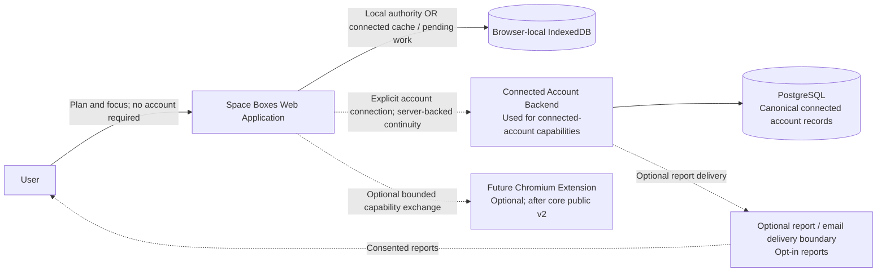
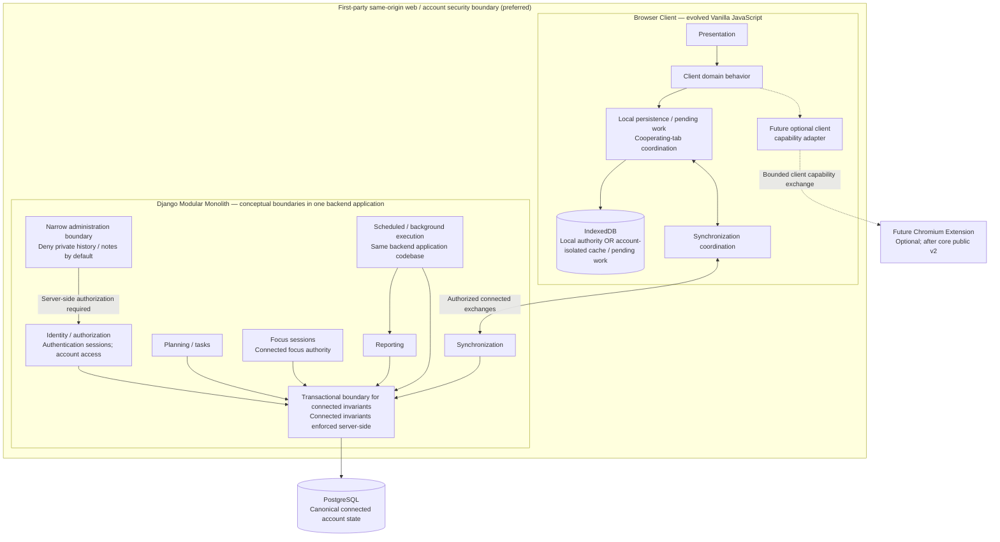
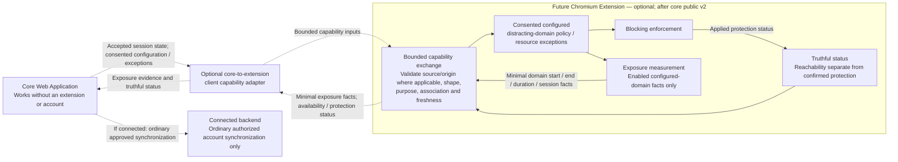

# Approved v2 architecture diagrams

These conceptual views visualize the approved direction in [architecture.md](architecture.md) and ADR-001–008. They describe architecture, not implemented capabilities. Solid arrows show responsibilities or conceptual exchanges. In flowcharts, dashed arrows represent optional relationships. In sequence diagrams, dashed arrows represent responses and do not imply optionality. Sequence ordering does not specify transport or freshness guarantees.

## 1. System context



**Shows:** Account-free browser use, optional account continuity, and future optional capabilities.

**Represents:** IndexedDB authority is limited to local-only browser scope; PostgreSQL is canonical for connected accounts. Core v2 ships before the extension.

**Does not imply:** Mandatory login, extension installation, a mail provider, or implementation-level APIs. The extension owns neither authentication nor focus authority; browser storage is not a guaranteed backup.

Related decisions: [ADR-001](adr/001-architecture-style.md), [ADR-003](adr/003-persistence.md), [ADR-004](adr/004-authentication.md), [ADR-005](adr/005-local-cloud-sync.md), [ADR-008](adr/008-extension-boundary.md).

## 2. Runtime / container view



**Shows:** Client responsibilities, Django domain boundaries, connected persistence, and scheduled execution using the same backend application codebase. The future extension adapter belongs to the client capability boundary.

**Represents:** A modular monolith with shared transactions, an evolved Vanilla JavaScript frontend, and separate identity and focus responsibilities. Authentication permits authorized access; it does not confer focus ownership. Scheduled work retains durable retry, deduplication, failure recording and recovery responsibilities; recovery-mail dispatch is separate from periodic report batches.

**Does not imply:** Independent services or deployments for internal modules, a concrete package layout, infrastructure topology, scheduler, worker system, or queue/broker selection. Administration does not grant unrestricted data access. The extension adapter is not a backend service or a requirement for local use.

Related decisions: [ADR-001](adr/001-architecture-style.md), [ADR-002](adr/002-backend-stack.md), [ADR-003](adr/003-persistence.md), [ADR-004](adr/004-authentication.md), [ADR-005](adr/005-local-cloud-sync.md), [ADR-006](adr/006-focus-session-authority.md), [ADR-007](adr/007-frontend-evolution.md), [ADR-008](adr/008-extension-boundary.md).

## 3. Local vs connected authority

```mermaid
flowchart TB
    subgraph LocalOnly["LOCAL-ONLY MODE — one browser origin / profile; no account"]
        Tabs["Cooperating tabs"]
        Serialized["Serialized local authority boundary"]
        LocalDB[("IndexedDB<br/>Authoritative local plans, history and persisted reservation")]
        LocalReservation["One running-or-paused reservation<br/>Respected across reloads and cooperating tabs"]
        Tabs --> Serialized
        Serialized --> LocalDB
        LocalDB --> LocalReservation
    end

    subgraph Connected["CONNECTED MODE — one authorized account across clients"]
        Clients["Multiple authorized clients<br/>Authentication does not select the controller"]
        Server["Server<br/>Canonical account state and transactional focus authority"]
        AccountDB[("PostgreSQL<br/>Canonical connected records / durable reservation")]
        AccountReservation["One account-scoped authoritative<br/>running-or-paused reservation"]
        Cache[("Connected IndexedDB per browser<br/>Account-isolated cache / pending work and evidence")]
        Clients <-->|"Accepted account state; authority requests"| Server
        Server --> AccountDB
        AccountDB --> AccountReservation
        Clients <--> Cache
        Cache -->|"Pending work / evidence for acceptance and reconciliation"| Server
    end
```



**Shows:** Two distinct persistence and exclusivity scopes. Local-only authority cannot identify the same anonymous person across independent devices or profiles.

**Represents:** One serialized, persisted reservation locally; one server-enforced account reservation when connected. Pause retains the reservation. Connected IndexedDB is cache/pending storage, never canonical account authority.

**Does not imply:** Cross-device anonymous exclusivity or fresh server acceptance of offline evidence. Connected new Start and takeover require server acceptance; only the previously accepted controller may persist offline continuation/Resume as pending or uncertain evidence. Notifications and timer displays do not enforce exclusivity; the local coordination primitive remains deferred.

Related decisions: [ADR-003](adr/003-persistence.md), [ADR-004](adr/004-authentication.md), [ADR-005](adr/005-local-cloud-sync.md), [ADR-006](adr/006-focus-session-authority.md).

## 4. Focus session authority sequence

```mermaid
sequenceDiagram
    participant A as Device A
    participant S as Server
    participant B as Device B

    Note over A,B: Both devices are authorized account clients; login does not grant focus ownership
    A->>S: Request Start
    S->>S: Enforce one account reservation; accept A as controlling context
    S-->>A: Start accepted; A controls the session
    S-->>B: Accepted session state; B observes without duplicate accounting

    A->>S: Request Pause
    S-->>A: Pause accepted; reservation retained
    Note over A,S: Missing keyboard/mouse input does not automatically release the reservation
    Note over A,S: Offline A may persist continued/Resume activity as pending or uncertain evidence, not fresh server acceptance

    B->>S: Request Start of another authoritative session
    S-->>B: Reject; an authoritative running-or-paused reservation exists
    Note over B: User explicitly requests takeover
    B->>S: Request explicit takeover
    S->>S: Check authoritative state; transfer control to B
    S-->>B: Transfer confirmed; B is controlling context
    Note over A,S: A loses control authority; its displayed state may remain stale until informed

    A->>S: Late authority-changing mutation
    S-->>A: Reject stale control authority
    A->>S: Submit late historical evidence
    S->>S: Preserve appropriate evidence for reconciliation
    Note over A,S: Ownership change alone does not discard history; unconfirmed time is reconciled before counting

    B->>S: Submit active-duration completion for acceptance
    S-->>B: Session ended; task completion remains an explicit separate action
    Note over S,B: Session completion does not start the next session automatically
```

**Shows:** Accepted Start, observation, paused exclusivity, rejected competing Start, explicit confirmed takeover, and separate handling of stale control versus historical evidence.

**Represents:** Server-owned connected authority, persisted reservations, and preservation of late evidence for reconciliation. Pause and planned breaks do not consume configured active duration.

**Does not imply:** APIs, status codes, locking SQL, heartbeat thresholds, transport timing, automatic counting of uncertain time, or automatic task completion. The server prevents two accepted controllers; it cannot prevent simultaneous human work or stale offline displays.

Related decisions: [ADR-003](adr/003-persistence.md), [ADR-004](adr/004-authentication.md), [ADR-005](adr/005-local-cloud-sync.md), [ADR-006](adr/006-focus-session-authority.md).

## 5. Local to connected account connection

```mermaid
sequenceDiagram
    actor U as User
    participant W as Browser Client
    participant L as IndexedDB
    participant S as Server
    participant P as PostgreSQL

    Note over W,L: Existing local v2 history and reservation remain locally persisted
    Note over S,P: Existing canonical account history and reservation may also exist
    U->>W: Explicitly choose Connect Account
    W->>L: Read local v2 history; retain pending evidence
    W->>S: Present local history for authorized account connection
    S->>P: Consult existing account state
    Note over L,P: Preserve both histories; no silent overwrite in either direction or whole-history last-write-wins
    Note over W,S: Connection must not silently create two authoritative focus sessions
    S->>S: Accept/reconcile appropriate records; detailed conflict handling deferred
    S->>P: Durably preserve accepted connected records and account invariants

    alt Successful connection and acknowledgement received
        S-->>W: Accepted account state and acknowledgement of accepted evidence
        W->>L: Use account-isolated cache / pending-work storage
        W->>L: Mark only acknowledged evidence synchronized; retain unacknowledged evidence
        Note over W,P: Server/PostgreSQL is canonical account authority after successful connection
    else Connection interrupted or acknowledgement absent
        Note over W,L: Retain unacknowledged pending evidence; do not mark it synchronized
        Note over W,P: Retries preserve both histories and must not duplicate accepted history
    end
```

**Shows:** Explicit connection of existing local v2 data to an account that may already contain history, durable acceptance, and browser acknowledgement.

**Represents:** Non-destructive connection, account-isolated connected storage, and the distinction between locally persisted evidence and acknowledged server persistence. Mutable plan conflicts and historical evidence conflicts remain separate categories. Only appropriately accepted/acknowledged pending evidence may be cleared as synchronized.

**Does not imply:** A merge/deduplication algorithm, conflict UI, identifiers, or automatic ownership mapping for an active local reservation. Unacknowledged data is retained even if a server acceptance occurred before a lost response. Account switching cannot mix caches or upload one account's pending work into another. V1 data remains separate without automatic migration.

Related decisions: [ADR-003](adr/003-persistence.md), [ADR-004](adr/004-authentication.md), [ADR-005](adr/005-local-cloud-sync.md), [ADR-006](adr/006-focus-session-authority.md).

## 6. Future extension boundary



**Shows:** The optional client adapter, consented domain policy, distinct blocking and exposure responsibilities, and backend involvement solely through ordinary connected synchronization. Local blocking requires no account or backend.

**Represents:** Least-privilege permission intent and minimal consented exchanges. Blocking enforcement ≠ exposure measurement; extension reachable ≠ protection confirmed active; extension ≠ authentication authority; extension ≠ focus authority. A client message alone is not proof of authority. Blocking-rule matches do not prove duration, attention, interruption or lost focus.

**Does not imply:** General browsing surveillance or exchange of private task notes, credentials, arbitrary page content, full URLs or full browsing history. It selects no permissions, browser APIs, manifest, messaging payloads, extension authentication, pause/break blocking policy or exposure aggregation. Restart, revocation, transfer and disconnect require truthful protection status and exposure uncertainty handling.

Related decisions: [ADR-004](adr/004-authentication.md), [ADR-005](adr/005-local-cloud-sync.md), [ADR-006](adr/006-focus-session-authority.md), [ADR-007](adr/007-frontend-evolution.md), [ADR-008](adr/008-extension-boundary.md).
