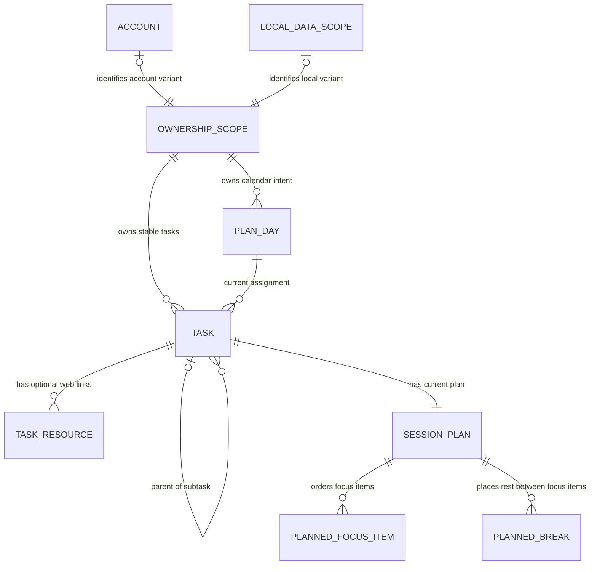
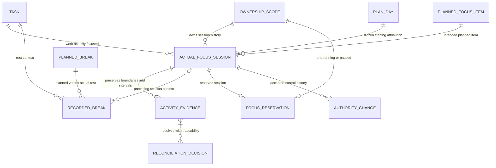
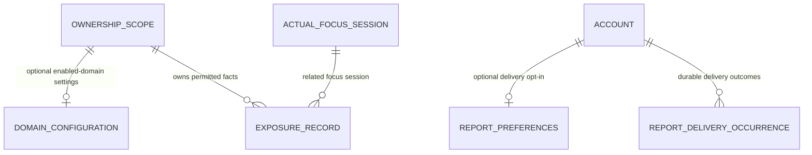

# Space Boxes Timer v2 conceptual/logical ERD

Status: DOCUMENTATION DESIGN — COMPANION TO THE OWNER-APPROVED MODELING PLAN

Prepared 2026-10-08 for V2-005. Read with the [data model](v2-data-model.md), including its source links, history rules, [traceability](v2-data-model.md#7-traceability-and-review-scenarios) and [deferred details](v2-data-model.md#8-deferred-details). These Mermaid ER views show logical ownership and historically important cardinalities, not a PostgreSQL schema or implemented behavior.

## 1. Ownership and mutable planning

- Each ownership scope identifies exactly one alternative: account or local data scope. The two optional identity edges are exclusive, not permission for an unowned or doubly owned scope. Historical originating scope is preserved when explicit connection establishes account ownership.
- Every persisted record must be attributable to one logical ownership scope, either directly or through its owning aggregate, with provenance where relevant. A Plan Day, task and task-owned components share that attribution; not every component needs a separate ownership value. Current task-to-day assignment can change; it is not the historical session-to-day relationship in the next view. Local date and timezone context express planning intent independently of actual instants.
- A task has at most one parent and may have multiple subtasks, without cycles or a selected depth limit. Hierarchy is distinct from Primary/Extra classification. No parent-child completion or duration rollup is implied.
- Zero to three simultaneous Primary assignments apply per scope/Plan Day, with no total-task cap. Classification and explicit completion/removal facts are task components, not separate task identities or focus sessions.
- The item collection represents user-selected count and durations; their sum is planned task focus. The diagram's zero-or-many notation does not approve a zero-session completed plan: required-plan validation limits remain unspecified. Break lengths/defaults likewise remain unspecified.
- Planned focus items and planned breaks are distinct concepts in an intentional session-plan sequence. Each break retains logical position/adjacency context identifying where the user placed it between planned focus items. No ordering column, PLAN_ITEM supertype, database representation or identifier/key encoding is selected; exact storage representation remains deferred.
- Resources contain web URLs with optional labels and no selected count cap. No upload entity is present.

## 2. Historical sessions, evidence and focus authority

Every actual session has one task, the planned item it started from, an attributable ownership scope and a starting Plan Day. Session/task/plan ownership must agree after accepted association. The originating local scope and intended account can remain distinguishable during pending connection. Planned focus items are independently identifiable logical items; retain the unambiguous original association even if a future-plan entry is removed. No UUID, database key, table, storage representation, one-to-one planned-to-actual mapping or retry policy is implied.

The following are components of the displayed logical aggregates, not extra entities or physical fields:

| Aggregate | Significant components |
| --- | --- |
| Actual focus session | Stable identity, minimal frozen title/classification, Plan Day/timezone, task planned start, planned-item association and configured active-focus target; only a parent-task reference when needed for historical context. Actual start, ending/outcome, explicitly derived/reconciled summaries and optional reflection; no independent current running/paused authority or duplicate detailed Pause/Resume boundaries. |
| Activity evidence | Authoritative historical timeline for active focus, pause, interruption and uncertain continuity, including detailed Pause/Resume boundaries; interval/boundary identity, origin/context, classification, trustworthy/open boundaries, certainty, interruption episode association and relevant accepted-control reference. |
| Reconciliation decision | Affected evidence references, known boundaries, decision/confirmation provenance and effective counted facts; retained originals permit overlap reconciliation. |
| Recorded break | Planned association, task/preceding-session context and actual boundaries/duration; planned rest is distinct from recorded elapsed rest. |
| Focus reservation | Single authoritative current running-or-paused control state, ownership scope, reserved session, controlling context and accepted authority version/reference within the applicable local or connected authority boundary. |
| Authority change | Accepted Start/control transition/lifecycle provenance, prior/resulting authority references and controller contexts; remains after reservation release. |

Session-start snapshots contain only facts needed to interpret historical activity, excluding task notes, resource collections, subtask inventories, full ancestry and the complete session/break plan. They are not copies of task aggregates.

The evidence-to-decision many-to-many edge permits a decision to address multiple overlapping fragments and preserves traceable corrections. Its cardinality allows each Activity Evidence item zero or more reconciliation decisions and requires every Reconciliation Decision to reference one or more Activity Evidence items. Uncertain fragments can have no decision yet. No association table or reconciliation algorithm is prescribed.

Authority and historical invariants require prose beyond ER cardinalities:

- At most one running-or-paused reservation exists in a scope. Its session shares that scope. Pause retains it without a duration cap; Resume retains exclusivity. Session end releases active reservation, not historical evidence.
- Focus Reservation alone owns current running/paused control. Activity Evidence owns the historical timeline. Actual Focus Session holds identity, frozen starting context, actual start, target, ending/outcome and explicitly derived/reconciled summaries without duplicating either authority. Timer/display state is a projection only.
- Local authority is persisted/serialized within one browser origin/profile. Connected authority is account-wide and server-enforced. A connected browser's cached reservation is a projection, not another authority.
- Authentication-session identity authorizes account access separately from the controlling context. Login, mirrored timer state and input activity do not confer control.
- Connected Start and confirmed takeover/transfer require server acceptance. An accepted control-version/reference distinguishes stale control-changing actions; no generation or locking scheme is specified.
- Former-controller mutations can be rejected while its late evidence is retained for reconciliation. Pending offline continuation/Resume from the previously accepted controller is not fresh accepted authority. Other offline contexts cannot acquire global control.
- Start is explicit; planned time never starts focus. Only confirmed/reconciled active focus consumes configured duration. Automatic session completion and early ending remain distinct outcomes and never implicitly complete a task or start the next session.
- Ordinary task/plan edits preserve snapshots, attribution and evidence. Finalized observations stay available; reconciliation records effective facts without silently replacing the observations.
- Recorded breaks add no active focus, pause, interruption duration or count. Their preceding-session edge does not turn rest into a pause. Detailed break attribution and optional timer behavior remain outside this ERD.

## 3. Optional exposure and report delivery

Domain configuration is an owned component with enabled configured domains and notice/permission context. Exposure records contain only the observed configured domain, start/end/duration and related session, with provenance/uncertainty metadata. They do not depend on the domain remaining in the current settings. Exposure may overlap focus; it is neither proof of interruption nor full browsing history. Page URLs/content and unrelated browsing are excluded. The later extension owns neither focus nor authentication authority and does not block core v2 release.

Report preferences retain selected cadence/channels. Delivery occurrences retain period/channel, preference relevance and attempt/outcome/failure references without depending on a still-existing preference record. Dispatch/retry must consult current opt-in and deletion state. Exact delivery timing/provider/worker mechanisms are deferred. In-app daily/task totals and report content derive from locally authoritative/reconciled facts in local-only mode and server-accepted canonical/reconciled facts in connected mode; local authority does not imply server acceptance. These outputs are not separate historical authorities; annual recap is eligible only after year completion.

## 4. Shared metadata and lifecycle boundary

Ownership/provenance and pending/acceptance/acknowledgement metadata accompany relevant records across all views; they are not additional canonical domain entities. Keep logical record identity, source scope/context, intended account association and acceptance references sufficient to preserve both histories and avoid duplicate credit. Distinguish continuity uncertainty from account acceptance and local acknowledgement.

Explicit local-to-account connection may leave an active local session's account association unresolved. No edge implies automatic authority transfer or a second accepted account reservation. Retain unacknowledged evidence; switching accounts never changes another account's pending/cache ownership. Whole-history last-write-wins replacement and automatic v1 migration are excluded.

Productivity export preserves meaningful relationships and facts. Ordinary task removal/cancellation retains historical associations. Conceptual deletion scope identifies canonical records, local cache/pending copies and in-product derived data, including stored report projections and in-product delivery state where applicable, with no revival through synchronization. External delivery, already-delivered reports, backup retention and deletion execution mechanics remain deferred. Physical cascades, formats, schedules, storage layout and transport mechanisms are not specified by these diagrams.
